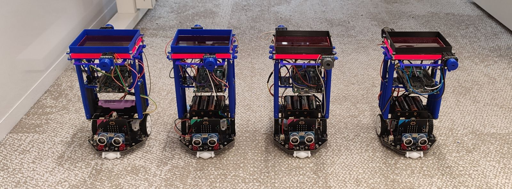

<picture>
  
</picture>

---

<div align="center">
    <h1>Edge-Light: Exploiting Luminescent Solar Concentrators for Ambient Light Communication</h1>
</div>

This repository contains the code used in this [paper](https://doi.org/10.1145/3678574) to perform basic and coordinated robotic tasks using Edge-Light. Additionally, it contains the scripts used to perform experiments and analize the data.

## 🌐 Overview
We modify a Maqueen Plus v2 educational robot for our purposes. Each modified robot use the following hardware: 
- Microbit
- Arduine Due
- TCS34725 Colour Sensor (CS)
- TCA9548A I2C Multiplexer
- Liquid Crystal (LC)
- Luminescent Solar Concentrator (LSC).

The Microbit allow us to program the educational robot, while the Arduino platform enables us to communicate and control the rest of the hardware as well as to perform FFT computations. Therefore, the organiztion of this repository is divided in three main folders: `arduino`, `microbit` and `scripts`. The latter is used mainly to receive data from Arduino and analize it. 

### 🤖 Arduino
---
This folder contains all the arduino related code. We use an Arduino Due because of the different ports it has to communicate with the hardware and its computational capacity. The following table gives details about each subfolder. Further instructions can be found in each `.ino` file.

| **Subfolder name**      | **Description**                                                                                                 |
|-------------------------|-----------------------------------------------------------------------------------------------------------------|
| dynamic_exp_reliability | Code uploaded to the master and slave robot to evaluate the link during dynamic experimets (the robots moving). |
| robotics_task           | Code uploaded to the master and slave robot to perform robotic cordinated tasks.                                |
| static_exp_reliability  | Code uploaded to the master and slave robot to evaluate the link during static experimets (the robots stopped). |
| visualize_cs            | Code to read CS data and print them over Serial or visualize them over Arduino Serial plotter                           |

### 🤖 Microbit
---
This folder contains all the microbit related code. Further details can be found in this [readme](./microbit/projects.md).

### 💻 scripts
---
This folder contains Python scripts to receive data from an Arduino Due over serial communication, analyze it and generate plots. It is divided in `green` and `red` subfolders referring to the color of each robot's LSC. However, both subfolders are very similar and the main difference is the `constants_{color}.py` file. We create both subfolders just for simplicity when performing experiments. The following table provides a brief description of each file.

| **Subfolder name**        | **Description**                                                                                                            |
|---------------------------|----------------------------------------------------------------------------------------------------------------------------|
| `color_sensor_{color}.py` | Retrieves the color sensor data when performing experiments (static or dynamic) and saves it in a `csv` file.            |
| `constants_{color}.py`    | Constant values used in other scripts.                                                                                     |
| `main_{color}.py`         | Retrieves the decoded bits sent by the LSC when performing experiments (static or dynamic) and saves it in a `csv` file. |
| `Utils_{color}.py`        | Contains different utility functions to retrieve data, analyze data and generate plots.                                    |

## Citation

If you find this repo useful for your academic work, please cite our original [paper](https://doi.org/10.1145/3678574).

```bibtex
@article{10.1145/3678574,
author = {Tapia, Miguel A. Ch\'{a}vez and Rodr\'{\i}guez, Diego Palma and Zamalloa, Marco Z\'{u}\~{n}iga},
title = {Edge-Light: Exploiting Luminescent Solar Concentrators for Ambient Light Communication},
year = {2024},
publisher = {Association for Computing Machinery},
volume = {8},
number = {3},
url = {https://doi.org/10.1145/3678574},
doi = {10.1145/3678574},
journal = {Proc. ACM Interact. Mob. Wearable Ubiquitous Technol.},
month = sep,
articleno = {94},
numpages = {23}
}

```